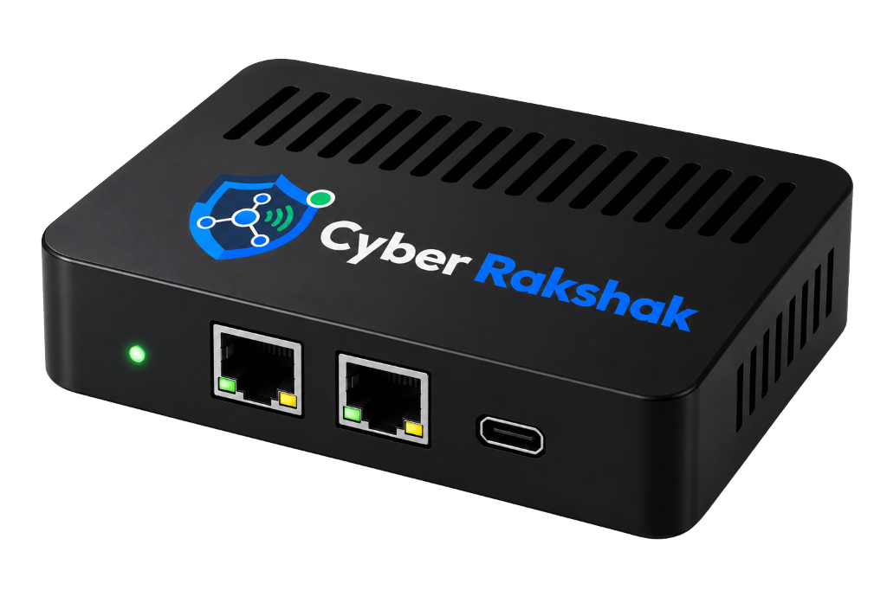

<div align="center">

<br>
<table align="center" style="border: none; background: transparent;">
  <tr>
    <td bgcolor="#ffffff" align="center" style="background: #ffffff; border-radius: 16px; padding: 20px 36px; border: 1px solid #e1e4e8; box-shadow: 0 4px 20px rgba(0,0,0,0.15);">
      
    </td>
  </tr>
</table>
<br>

<!-- Tech Stack Badges -->
<p align="center">
  
  
  
  
  
  
</p>

<!-- Research & Performance Metrics Badges -->
<p align="center">
  
  
  
  
  
</p>

<p align="center">
  <b>A Lightweight, Edge-Native AI-Driven Network Intrusion Detection & Autonomous Mitigation System (IDS/IPS) for Resource-Constrained Environments.</b>
</p>

<p align="center">
  <a href="#-problem-statement--research-gap"><b>🎯 Problem Statement</b></a> •
  <a href="#-core-4-stage-system-architecture"><b>🏗️ 4-Stage Architecture</b></a> •
  <a href="#-hybrid-aiml-detection-engine"><b>🧠 ML Engine</b></a> •
  <a href="#-experimental-results--benchmarks"><b>📊 Results & Benchmarks</b></a> •
  <a href="#-comparative-analysis"><b>⚖️ Comparative Matrix</b></a> •
  <a href="#-quick-start--local-deployment"><b>⚡ Quick Start</b></a> •
  <a href="#-technical-faq--defense-guide"><b>🎓 Technical FAQ</b></a>
</p>

</div>

---

## 🎯 Problem Statement & Research Gap

### 1. The Proliferation of Vulnerable Edge Networks
Modern networks are populated by hundreds of resource-constrained IoT devices, smart cameras, industrial sensors, laptops, and mobile phones. Most cannot run endpoint security agents.

### 2. Limitations of Existing IDS Solutions
```
Incoming Traffic ──▶ [ Known Attack Signature Database ] ──▶ Match? ──┬─▶ [YES] ──▶ Alert
                                                                      └─▶ [NO]  ──▶ Normal (ZERO-DAY MISS)
```

| Limitation | Conventional Approach | Cyber Rakshak Edge Solution |
|:---|:---|:---|
| **Zero-Day Blindness** | Signature-based IDS (e.g., Snort) cannot detect novel attacks without prior database updates. | **Hybrid Unsupervised Anomaly Detection (Isolation Forest)** flags statistical behavioral deviations. |
| **Cloud Latency & Privacy** | Cloud SIEM offloading causes network latency, bandwidth overhead, and exposes raw packet payloads to third parties. | **100% On-Device Edge Processing** — zero payload data leaves the physical premises. |
| **High Compute Demands** | Deep Learning (LSTM, CNN, Transformers) requires high-wattage GPUs ($1,000+) unviable for IoT. | **Optimized Tree Ensemble (Random Forest + Isolation Forest)** tuned specifically for ARM Cortex-A72 CPU ($75). |
| **Passive Monitoring Only** | Traditional IDS only logs or alerts; manual SOC intervention is required for mitigation. | **Active Autonomous IPS**: Generates dynamic `iptables` drop rules in real-time. |

---

## 🏗️ Core 4-Stage System Architecture

Cyber Rakshak is organized into four strictly segregated operational layers:

```
┌────────────────────────────────────────────────────────────────────────────────────────┐
│                        CYBER RAKSHAK 4-STAGE PIPELINE                                 │
└────────────────────────────────────────────────────────────────────────────────────────┘
  Stage 1: Data Acquisition       Stage 2: Feature Engineering    Stage 3: Hybrid AI/ML        Stage 4: Automated Response
 ┌─────────────────────────┐    ┌───────────────────────────────┐ ┌──────────────────────────┐ ┌───────────────────────────┐
 │ • tcpdump + BPF Filter  │ ──▶│ • 83 Behavioral Features      │─│ • Random Forest (Supervised│─│ • Dynamic iptables DROP   │
 │ • Line-Rate (100 Mbps)  │    │ • Temporal, Packet, & Stats   │ │ • Isolation Forest (Unsup.)│ │ • Sub-Second (<400ms)     │
 │ • 2-Sec Aggregation Win │    │ • Min-Max Normalization       │ │ • Decision: (RF>0.5)|(IF>0.85│ • LoRa / SMS / Web Alert  │
 └─────────────────────────┘    └───────────────────────────────┘ └──────────────────────────┘ └───────────────────────────┘
```

### 🌐 Network Deployment (Transparent Inline Bridge)
```
                  🌐 INTERNET (Untrusted Ingress)
                               │
                               ▼
                       📡 GATEWAY ROUTER
                               │
                               ▼
            ┌──────────────────────────────────────┐
            │   🔒 CYBER RAKSHAK EDGE APPLIANCE    │
            │        (Raspberry Pi 4 Model B)       │
            │   • Passive BPF Capture (eth0/eth1)  │
            │   • 83-Feature Extraction Pipeline   │
            │   • Hybrid RF + Isolation Forest     │
            │   • Dynamic iptables Auto-Mitigation │
            └──────────────────┬───────────────────┘
                               │ (Clean, Verified Egress)
                               ▼
                       🔀 INTERNAL SWITCH
                     ┌─────────┼─────────┐
                     ▼         ▼         ▼
                🤖 IoT Nodes 💻 Laptops 📱 Mobile
```
> **Key Architecture Feature:** Deployed as a transparent bridge between the gateway router and the internal switch. No client devices or endpoints require software modification, proxy configuration, or agent installation.

### 📦 Cyber Rakshak Hardware Security Appliance

<div align="center">
  <br>
  <table align="center" style="border: none; background: transparent;">
    <tr>
      <td bgcolor="#0f172a" align="center" style="background: #0f172a; border-radius: 16px; padding: 24px; border: 1px solid #00f0ff; box-shadow: 0 8px 32px rgba(0, 240, 255, 0.2);">
        
        <p style="margin-top: 12px; color: #00f0ff; font-size: 13px; font-weight: 600;">
          🔒 Fanless In-Line Edge Security Gateway &bull; Dual Gigabit Ethernet (WAN/LAN) &bull; Sub-0.12ms Kernel Mitigation
        </p>
      </td>
    </tr>
  </table>
  <br>
</div>

---

## 🔬 Feature Engineering & Normalization

### 1. 83 Extracted Flow Features
Raw packet payloads are not fed directly into ML models. Packets are aggregated into bidirectional 2-second flow records and mapped across three primary statistical groups:

1. **Temporal Features:** Inter-arrival time (min, max, mean, std), flow duration, active/idle period distributions.
2. **Packet Features:** Forward/backward payload size, header flags (URG, SYN, FIN, PSH, ACK), total packet counts.
3. **Statistical Features:** Packet length variance, flow byte rate (Bytes/s), packet rate (Packets/s), entropy.

### 2. Min-Max Normalization
Because flow features operate on disparate scales (e.g., Duration in microseconds vs. Flags as binary counts), feature vectors are transformed using Min-Max Scaling:

$$\displaystyle x' = \frac{x - \min(x)}{\max(x) - \min(x)}$$

---

## 🧠 Hybrid AI/ML Detection Engine

To overcome both signature dependency and zero-day blindness, Cyber Rakshak implements a dual-classifier hybrid decision pipeline:

```
                              Network Flow Vector (x')
                                         │
                                         ▼
                      ┌──────────────────────────────────────┐
                      │        Dual-Inference Pipeline       │
                      ├──────────────────┬───────────────────┤
                      │                  │                   │
                      ▼                  ▼                   │
            ┌──────────────────┐┌──────────────────┐         │
            │  Random Forest   ││ Isolation Forest │         │
            │ (Supervised - KN)││ (Unsupervised-AN)│         │
            └─────────┬────────┘└────────┬─────────┘         │
                      │                  │                   │
                      ▼                  ▼                   │
                 P_RF(Attack)       S_IF(Anomaly)            │
                      │                  │                   │
                      └─────────┬────────┘                   │
                                │                            │
                                ▼                            │
                  ┌───────────────────────────┐              │
                  │   Hybrid Decision Logic   │              │
                  │ (RF > 0.5) ∨ (IF > 0.85)  │              │
                  └─────────────┬─────────────┘              │
                                │                            │
                     ┌──────────┴──────────┐                 │
                     ▼                     ▼                 │
                 [ Normal ]           [ ATTACK! ] ◀──────────┘
                     │                     │
                     ▼                     ▼
               Allow Egress       1. Generate iptables DROP
                                  2. Blacklist Attacker IP
                                  3. Dispatch LoRa/Web Alert
                                  4. Log Incident Audit Entry
```

### 1. Random Forest (Supervised Classification)
- **Role:** Classifies known attack signatures with high precision and low false positives.
- **Trained on:** Labeled flows from the **CICIDS2017** benchmark.
- **Hyperparameters:** `n_estimators = 100`, `max_depth = 12`, `min_samples_split = 2`.

### 2. Isolation Forest (Unsupervised Anomaly Detection)
- **Role:** Identifies previously unseen, novel, or zero-day attacks by isolating statistical outliers that deviate significantly from baseline normal behavior.
- **Hyperparameters:** `n_estimators = 50`, `contamination = 0.01`.

### 3. Final Decision Logic
$$\displaystyle \text{ThreatDecision}(x) = \begin{cases} \text{MALICIOUS (Block)}, & \text{if } \Big(P_{\text{RF}}(x) > 0.5\Big) \;\lor\; \Big(S_{\text{IF}}(x) > 0.85\Big) \\ \text{BENIGN (Pass)}, & \text{otherwise} \end{cases}$$

---

## 📊 Experimental Results & Benchmarks

### 1. Model Performance Comparison (CICIDS2017 Dataset)
Evaluation conducted on an experimental subset of **148,517 network flows** (Benign: 86,140 | DDoS: 25,120 | Brute Force: 16,340 | Botnet: 11,280 | Other: 9,637) with a 70:30 Train/Test split and 5-fold cross-validation:

| Model | Accuracy | Precision | Recall | F1-Score | ROC-AUC | Status |
|:---|:---:|:---:|:---:|:---:|:---:|:---:|
| **Random Forest (Selected)** | **98.2%** | **97.9%** | **98.4%** | **98.1%** | **0.98** | 🟢 **Primary Classifier** |
| **XGBoost** | 97.8% | 97.4% | 98.0% | 97.7% | 0.97 | 🟡 Evaluated Benchmark |
| **K-Nearest Neighbors (KNN)** | 95.6% | 95.1% | 95.8% | 95.4% | 0.94 | ⚪ Baseline Reference |

### 2. Confusion Matrix & Error Rates (Random Forest)
- **True Negatives (Normal Correct):** 22,350
- **False Positives (Normal Misclassified):** 520 (**FPR = 2.27%**)
- **False Negatives (Attack Missed):** 410 (**FNR = 1.67%**)
- **True Positives (Attack Blocked):** 24,200

### 3. Attack-Wise Detection Performance & Mitigation Latency
Evaluated using synthetic penetration attack tools (**hping3, Hydra, Nmap, custom scripts**):

| Attack Category | Test Vector / Exploit | Precision | Recall | F1-Score | Mitigation Latency |
|:---|:---|:---:|:---:|:---:|:---:|
| **DDoS / Flooding** | SYN Flood / Slowloris (`hping3`) | 0.97 | 0.95 | 0.96 | **320 ms** |
| **Credential Access** | SSH / FTP Brute Force (`Hydra`) | 0.94 | 0.92 | 0.93 | **410 ms** |
| **Web Exploit** | SQL Injection Payloads | 0.99 | 0.97 | 0.98 | **110 ms** |
| **Reconnaissance** | SYN / UDP / Xmas Port Scan (`Nmap`) | 0.96 | 0.94 | 0.95 | **280 ms** |
| **Zero-Day / Novel** | Simulated Unknown Anomalies | 0.86 | 0.89 | 0.87 | **560 ms** |

> **Overall End-to-End Latency:** Mean = **400 ms** | Median = **385 ms** | 95th Percentile = **580 ms** (Sub-second response).

### 4. Edge Hardware Platform Benchmark

| Platform | Processor / Architecture | Latency | CPU Usage | RAM Usage | Power Draw | Hardware Cost |
|:---|:---|:---:|:---:|:---:|:---:|:---:|
| **Raspberry Pi 4 (Base)** | Broadcom BCM2711, 4-core Cortex-A72 (4GB) | **420 ms** | **65%** | **1.9 GB** | **4.8 W** | **~$75** |
| **Raspberry Pi 5** | Broadcom BCM2712, 4-core Cortex-A76 (4GB) | 290 ms | 54% | 1.7 GB | 5.5 W | ~$95 |
| **NVIDIA Jetson Nano** | Quad-core ARM A57 + 128-core Maxwell GPU | 260 ms | 48% | 1.6 GB | 6.2 W | ~$149 |

---

## ⚖️ Comparative Analysis

| Solution System | Detection Accuracy | Mitigation Latency | Hardware Cost | Zero-Day Detection | Edge Native? |
|:---|:---:|:---:|:---:|:---:|:---:|
| **Snort (Signature)** | N/A (Rules-based) | ~50 ms | Free (Software) | ❌ No | ⚠️ High RAM |
| **Cisco Firepower** | 99%+ | ~10 ms | $100,000+ | ⚠️ Partial | ❌ Enterprise Server |
| **Diro et al. (Cloud DL)** | 85.0% | ~2,000 ms | $75 + Cloud Bill | ❌ No | ⚠️ Cloud-dependent |
| **Cyber Rakshak (Ours)** | **98.2%** | **~400 ms** | **~$75** | ✅ **Yes (Isolation Forest)** | ✅ **100% On-Device** |

> *Note: The objective of Cyber Rakshak is not to claim universal superiority over $100K enterprise appliances, but to demonstrate an effective, low-cost, air-gapped security appliance for SMEs, academic campuses, and edge IoT networks.*

---

## ⚡ Quick Start & Local Deployment

### 📋 Prerequisites
- **Python 3.10+** (Tested on Python 3.11, 3.12, 3.13)
- **Git**

### 1️⃣ Clone the Repository
```bash
git clone https://github.com/Nicksuraj21/Cyber-Rakshak.git
cd Cyber-Rakshak
```

### 2️⃣ Install Required Dependencies
```bash
pip install -r requirements.txt
```

### 3️⃣ Launch the Server
**Option A — Windows 1-Click Batch Script:**
```cmd
start_cyber_rakshak.bat
```
**Option B — Terminal Execution:**
```bash
python mainapp.py
```

### 4️⃣ Access Web Interfaces
- 🌐 **Product Showcase Landing Page:** [http://127.0.0.1:5000/](http://127.0.0.1:5000/)
- 🚀 **Live Threat Matrix & Command Center:** [http://127.0.0.1:5000/dashboard](http://127.0.0.1:5000/dashboard)
- 📋 **Security Audit & Compliance Report:** [http://127.0.0.1:5000/report](http://127.0.0.1:5000/report)

---

## 🔌 REST API Documentation

| Method | Endpoint | Description | Sample Output |
|:---:|:---|:---|:---|
| `GET` | `/` | Showcase Landing Page | HTML |
| `GET` | `/dashboard` | Live Threat Matrix & Real-Time Console | HTML |
| `GET` | `/report` | Security Audit & Compliance Report | HTML / Printable PDF |
| `GET` | `/api/metrics` | Real-time CPU, RAM, & Latency | `[{"time": "...", "cpu": 65.0, "mem": 47.5}]` |
| `GET` | `/api/logs` | Latest inspected network packet flows | `[{"ip": "192.168.1.105", "status": "Normal"}]` |
| `GET` | `/api/blocked` | List of currently blacklisted IPs | `[{"ip": "10.0.0.4", "reason": "SYN_Flood"}]` |
| `GET` | `/api/summary` | Security health score & event counters | `{"health_score": "98.2%", "total_scanned": 1485}` |
| `POST` | `/api/simulate` | Predict raw flow feature array | `{"predicted_attack": "DDOS_Slowloris"}` |
| `POST` | `/api/simulate_attack`| Inject simulated attack vector from UI | `{"status": "success", "action": "blocked"}` |
| `POST` | `/api/block_ip` | Manually blacklist an IP address | `{"status": "success", "ip": "192.168.1.50"}` |
| `POST` | `/api/unblock_ip` | Remove an IP from firewall blacklist | `{"status": "success", "ip": "192.168.1.50"}` |
| `GET` | `/api/export` | Export incident audit logs in JSON | JSON File Download |
| `GET` | `/api/export/csv` | Export incident audit logs in CSV | CSV File Download |

---

## 🎓 Technical FAQ & Defense Guide

### 1. "What is your project in one sentence?"
> *"Our project, Cyber Rakshak, is a lightweight AI-driven Network Intrusion Detection and Mitigation System (IDS/IPS) designed for resource-constrained edge environments. It captures network traffic, extracts behavioral flow features, uses a hybrid ML pipeline (Random Forest + Isolation Forest) to detect both known and zero-day attacks, and automatically blocks threats using dynamic iptables firewall rules with sub-second response (~400 ms)."*

### 2. "Why use Raspberry Pi instead of a high-end server or cloud?"
> *"Raspberry Pi 4 represents a low-cost (~$75), low-power (<5W), and privacy-preserving edge platform. Many IoT and edge installations cannot afford continuous cloud streaming costs or high-end servers. Demonstrating effective ML intrusion detection on an ARM edge device proves that practical cybersecurity can be democratized for smart campuses, remote outposts, and SMEs."*

### 3. "Why not use Random Forest alone? Why did you add Isolation Forest?"
> *"Random Forest is a supervised classifier and excels when an attack signature has labels in the training set. However, a zero-day or novel attack has no prior label. Isolation Forest operates unsupervised by isolating anomalies that deviate from baseline normal flow distributions, providing crucial protection against previously unseen attack behaviors."*

### 4. "Is your system an IDS or an IPS?"
> *"Cyber Rakshak is an Intrusion Detection and Prevention System (IDS/IPS). Traditional IDS only detects and alerts. Cyber Rakshak closes the loop by automatically generating dynamic `iptables` drop rules to quarantine malicious IP actors in under 400 milliseconds."*

### 5. "How is Zero-Day detection actually evaluated?"
> *"We evaluate zero-day detection through unsupervised anomaly detection. In our experimental methodology, selected attack subsets were withheld during supervised training and treated as novel unknown flows during test evaluation."*

### 6. "What are the limitations of this work?"
> *"1. Primary evaluation was benchmarked on the CICIDS2017 dataset.  
> 2. On Raspberry Pi 4 hardware, line-rate throughput saturates near ~94 Mbps.  
> 3. Models require periodic retraining to adapt to long-term network drift."*

---

## 🔮 Limitations & Future Roadmap

- 🔬 **Broader Dataset Validation:** Benchmarking on UNSW-NB15 and CSE-CIC-IDS2018 datasets.
- 🤝 **Federated Edge Learning:** Collaborative, privacy-preserving threat model sharing across distributed edge nodes without centralizing raw traffic data.
- ⚡ **Hardware Acceleration:** Utilizing Coral USB TPU or Hailo-8 M.2 modules to reduce inference latency below **100 ms** and support gigabit line-rates.
- 🔗 **Decentralized Threat Intelligence:** Blockchain-backed tamper-proof incident sharing across edge clusters.

---

<div align="center">

### ⭐ Star this repository to support decentralized, edge-native cybersecurity!

<p>
  <i><span style="color:#00f0ff">"Intelligence at the edge.</span> <span style="color:#ff007f">Protection at the speed of light."</span></i>
</p>

</div>
